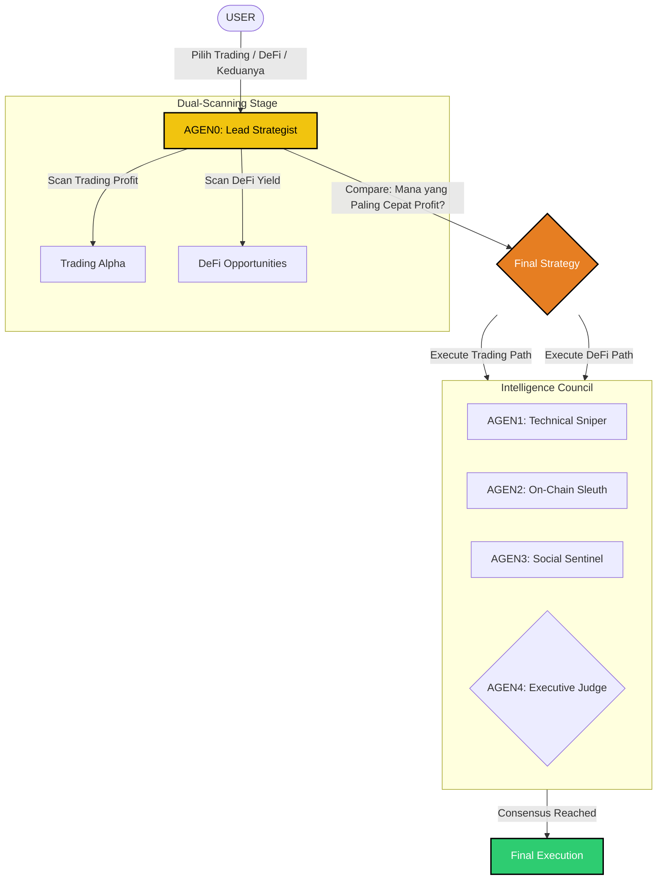

# 🏗️ SOMGEN PREDATOR Technical Architecture (V4)

Sistem SOMGEN PREDATOR dirancang sebagai mesin otonom berbasis **Multi-Agent Council**. Alur logika teknis terbaru (V4) kini menyertakan fitur **"Commander Choice"** di mana AGEN0 melakukan perbandingan profitabilitas antara pasar Trading dan ekosistem DeFi.

## 🧬 Technical Logic Flow

---

## 🏛️ Komponen Logika Terkini

### 1. Commander Choice Layer (AGEN0)
*   **Dual-Scanning**: AGEN0 secara simultan mengecek indikator trading (Price Action) dan peluang DeFi (Yield/Arbitrase).
*   **Profit Comparison**: Melakukan komputasi untuk menentukan jalur mana yang memiliki *risk-to-reward* terbaik saat ini.
*   **Mission Briefing**: Memberikan perintah spesifik ke agen lain agar tidak membuang waktu menganalisa jalur yang tidak dipilih.

### 2. Council Deep Reasoning
Setelah AGEN0 menentukan jalur, tim spesialis mulai bekerja:
*   **AGEN1 (Technical)**: Mencari titik entri (jika Trading) atau mencari selisih harga (jika DeFi Arbitrase).
*   **AGEN2 (On-Chain)**: Memantau Whale (jika Trading) atau menghitung APY & Health Factor (jika DeFi Yield).
*   **AGEN3 (Social)**: Memverifikasi keamanan berita atau protokol yang dipilih.

### 3. Executive Judgment (AGEN4)
*   Memastikan keputusan AGEN0 didukung oleh data dari AGEN1, 2, dan 3.
*   Mengeluarkan vonis final: **EXECUTE** (Jalankan) atau **REJECT** (Batalkan jika risiko mendadak tinggi).

---

## 🚀 Filosofi "Efficiency First"
V4 mengutamakan kecepatan eksekusi profit. Dengan melakukan perbandingan di awal (AGEN0), SOMGEN memastikan modal Anda tidak diam di aset yang stagnan jika ada peluang bunga yang lebih tinggi di sektor DeFi.

**SOMGEN: Decision-Driven. Profit-Oriented.** 🌌🛡️⚖️💰🚀
