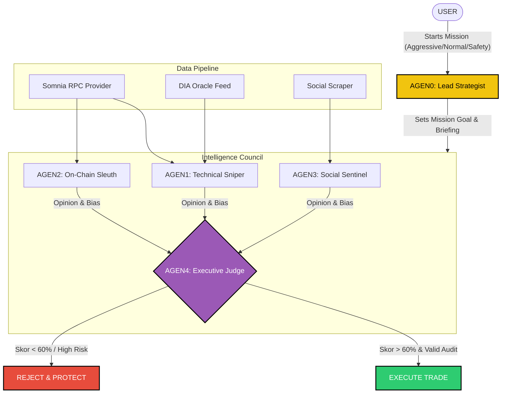

# 🏗️ SOMGEN PREDATOR Technical Architecture

Sistem SOMGEN PREDATOR dirancang sebagai mesin otonom berbasis **Multi-Agent Council**. Alur logika teknisnya memastikan setiap keputusan trading melalui proses briefing, debat, audit, hingga eksekusi final.

## 🧬 Technical Logic Flow

---

## 🏛️ Komponen Logika

### 1. Commander Layer (AGEN0)
*   Menerima instruksi dari User.
*   Melakukan kalkulasi target awal berdasarkan profil risiko.
*   Memberikan *briefing* awal kepada dewan agen untuk membatasi ruang lingkup pencarian.

### 2. Analysis Layer (AGEN1, AGEN2, AGEN3)
*   **AGEN1**: Fokus pada indikator teknis (RSI, Trendline) dari DIA Oracle.
*   **AGEN2**: Menganalisa pergerakan Whale dan likuiditas dari Somnia RPC.
*   **AGEN3**: Melakukan audit sentimen komunitas dan berita web melalui scraper.

### 3. Judgment Layer (AGEN4)
*   Menerima opini dari seluruh Analysis Layer.
*   Melakukan pembobotan konsensus.
*   Menghitung **Leverage** secara dinamis berdasarkan *Confidence Score*.
*   Memberikan vonis final (LONG/SHORT/REJECT).

---

## 🚀 Deep Reasoning Protocol
Setiap langkah dalam diagram di atas mengikuti protokol **Deep Reasoning** di mana agen melakukan sinkronisasi data selama 3-6 detik untuk menjamin determinisme sebelum mengeluarkan output.

**SOMGEN: Built for Precision. Optimized for Somnia.** 🌌🛡️⚖️
